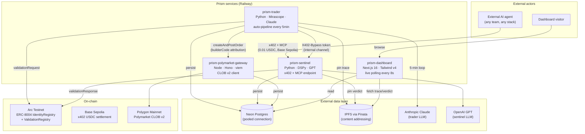
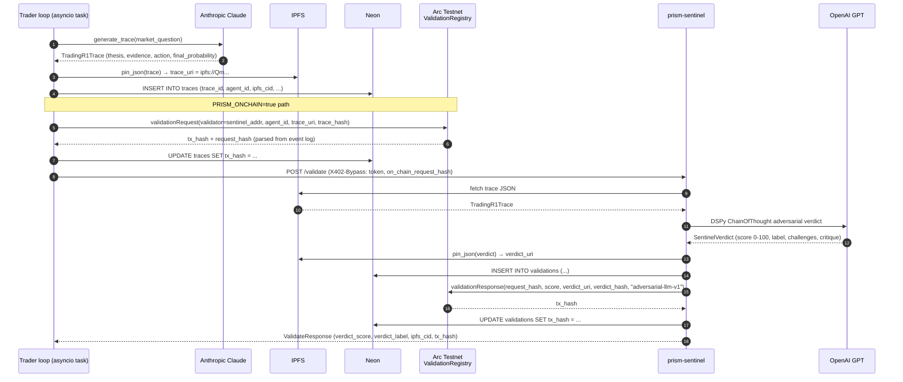
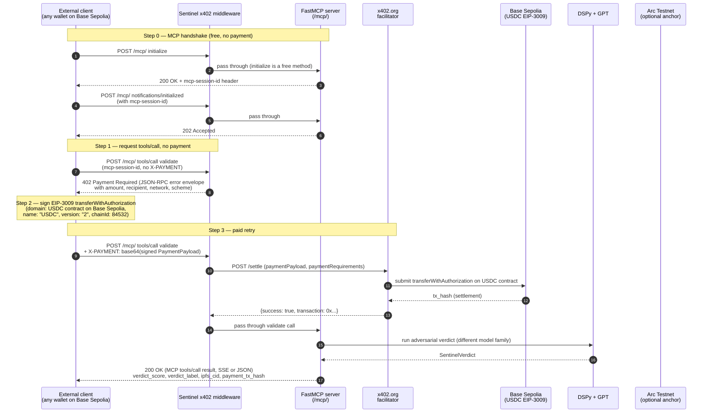
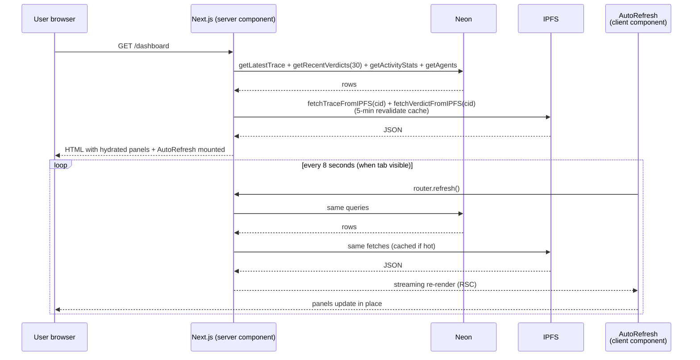
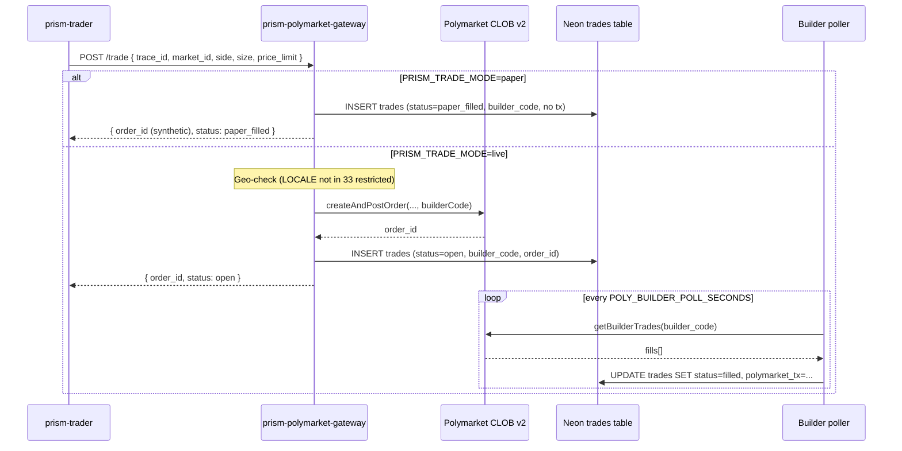
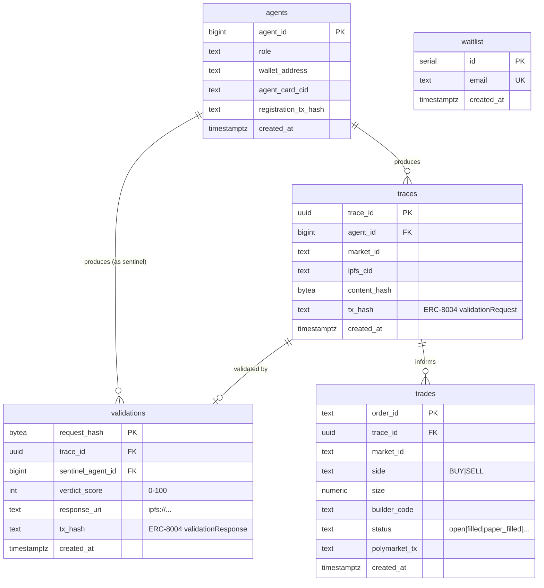
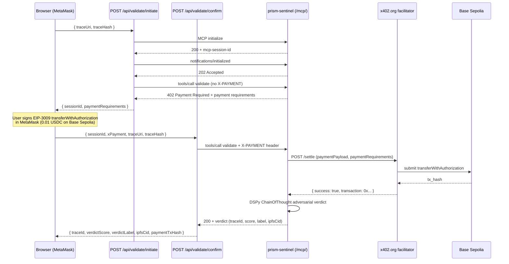
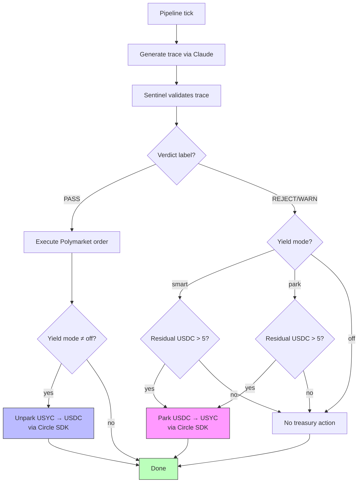

# Prism — Architecture

The first adversarial AI validator on ERC-8004. Two agents from different
model families challenge each other before capital moves; every verdict is
anchored on Arc Testnet; the sentinel is sold by the call over x402.

This document is the public system map: what services exist, how they
talk, and what's verifiable on which chain.

---

## System map



---

## Services in detail

| Service | Language | Role | Port |
|---|---|---|---|
| `prism-trader` | Python 3.12 / Mirascope / Claude | Generates Trading-R1 reasoning traces every 5 min, submits ERC-8004 `validationRequest`, calls sentinel via internal bypass, optionally executes Polymarket orders | 3201 |
| `prism-sentinel` | Python 3.12 / DSPy / GPT | Adversarially validates traces (evidence challenges, thesis challenges, calibration critique). Exposes `POST /validate` (REST) and `/mcp/` (FastMCP, x402-protected) | 3202 |
| `prism-polymarket-gateway` | Node 20 / Hono / viem | Wraps `@polymarket/clob-client-v2`. Adds `builderCode` to every order. Polls fills, persists to DB. Paper-mode + live-mode | 3203 |
| `prism-dashboard` | Next.js 16 / React 19 / Tailwind v4 | Public surface. Live polling, verdict history, confidence-collision viz, adversarial dialogue, on-chain receipts | 3200 |

The MCP module (`apps/mcp/`) is **not a separate service** — it's an ASGI
sub-app mounted on `prism-sentinel` at `/mcp/`. This is a deliberate
deployment shortcut for the hackathon.

---

## Sequence diagram — the trader auto-pipeline (every 5 minutes)



**What you can verify on-chain:** every successful pipeline tick produces
**two** transactions on Arc Testnet — a `validationRequest` from the trader
wallet (`0xc960833e…`) and a `validationResponse` from the sentinel wallet
(`0x56509b03…`), both calling the
[ValidationRegistry at `0x8004Cb1BF31DAf7788923b405b754f57acEB4272`](https://testnet.arcscan.app/address/0x8004Cb1BF31DAf7788923b405b754f57acEB4272).

---

## Sequence diagram — external x402 + MCP call (the "sentinel-as-a-service" demo)



**Verifiable artifacts produced by one external call:**

- USDC transfer on **Base Sepolia** at the facilitator-submitted tx hash
- A pinned verdict JSON on IPFS
- A row in Neon's `validations` table

**One thing this flow does NOT do:** anchor the verdict on Arc. That's
intentional — the external client has no agent identity on Arc, so there's
no preceding `validationRequest` to anchor a `validationResponse` against.
This is the trade-off of accepting payments from anyone vs. only validating
agents that registered on ERC-8004. The auto-pipeline path keeps the full
on-chain story for Prism's own trader.

---

## Sequence diagram — dashboard live polling



`router.refresh()` is preferred over a custom `/api/dashboard-state` route
because it re-runs the existing server components, reusing the IPFS cache,
without any client-side data model.

---

## Polymarket trade flow (paper vs live)



The `builderCode` is a 32-byte hex value Prism owns; **every order created
through this gateway includes it**, so when the order fills, Prism gets
builder-fee revenue. Prism enforces this in `gateway.ts`, not as a manual
reminder.

---

## Data layer



All services connect to the **same Neon database** over the pooled
connection string (`-pooler` suffix). Unpooled URLs are reserved for
migrations only.

---

## Verifiable on-chain identifiers

| What | Where | Address / contract |
|---|---|---|
| ERC-8004 IdentityRegistry | Arc Testnet | [`0x8004A818BFB912233c491871b3d84c89A494BD9e`](https://testnet.arcscan.app/address/0x8004A818BFB912233c491871b3d84c89A494BD9e) |
| ERC-8004 ValidationRegistry | Arc Testnet | [`0x8004Cb1BF31DAf7788923b405b754f57acEB4272`](https://testnet.arcscan.app/address/0x8004Cb1BF31DAf7788923b405b754f57acEB4272) |
| ERC-8004 ReputationRegistry | Arc Testnet | [`0x8004B663056A597Dffe9eCcC1965A193B7388713`](https://testnet.arcscan.app/address/0x8004B663056A597Dffe9eCcC1965A193B7388713) |
| Trader Circle wallet (EOA) | Arc Testnet | [`0xc960833ee26e23ca01dfc4d217a8942ea78b452b`](https://testnet.arcscan.app/address/0xc960833ee26e23ca01dfc4d217a8942ea78b452b) |
| Sentinel Circle wallet (EOA) | Arc Testnet | [`0x56509b03e85f3cbae5ba2190ee99b945d2f0ac36`](https://testnet.arcscan.app/address/0x56509b03e85f3cbae5ba2190ee99b945d2f0ac36) |
| Oracle Circle wallet (EOA) | Arc Testnet | [`0xc95dfe848354482830805cdd8b8233a918cd16f7`](https://testnet.arcscan.app/address/0xc95dfe848354482830805cdd8b8233a918cd16f7) |
| Prism x402 recipient | Base Sepolia (testnet) / Base mainnet | `0x1453ba8a6bDD647eB98F380443FDD54074fffD1F` |
| Polymarket builder code | Polygon mainnet | `0x9e599436ce291bcda25bd18c611e46eb54bd7dd12bead05d0027802a9ef30c2e` |

The three Arc wallets are **Circle Developer-Controlled Wallets** with
`accountType=EOA`. SCA migration is post-hackathon work.

### Circle Developer-Controlled Wallets — detail

- **Wallet set:** Single wallet set containing 3 wallets, managed via
  `CIRCLE_WALLET_SET_ID`.
- **Account type:** EOA (not SCA). Verified May 13, 2026 via Circle API.
  Gas Station sponsorship requires SCA — post-hackathon work. Current gas
  cost: ~0.003–0.005 USDC per contract execution on Arc Testnet.
- **Key management:** Circle holds encrypted key shares; entity secret
  (operator-controlled) required for transaction signing. No raw private
  keys in codebase.
- **SDK package:** `circle-developer-controlled-wallets` (PyPI). Import
  path: `circle.web3`. Synchronous SDK — wrapped with `asyncio.to_thread()`
  in the trader.
- **Blockchain identifier:** `ARC-TESTNET` in Circle API calls.

| Wallet | Circle Wallet ID env var | Arc Testnet Address | Role |
|---|---|---|---|
| Trader | `CIRCLE_WALLET_TRADER_ID` | [`0xc960833ee26e23ca01dfc4d217a8942ea78b452b`](https://testnet.arcscan.app/address/0xc960833ee26e23ca01dfc4d217a8942ea78b452b) | Signs validationRequest, executes trades, parks/unparks USYC |
| Sentinel | `CIRCLE_WALLET_SENTINEL_ID` | [`0x56509b03e85f3cbae5ba2190ee99b945d2f0ac36`](https://testnet.arcscan.app/address/0x56509b03e85f3cbae5ba2190ee99b945d2f0ac36) | Signs validationResponse, receives x402 payments (Arc mode) |
| Oracle | `CIRCLE_WALLET_ORACLE_ID` | [`0xc95dfe848354482830805cdd8b8233a918cd16f7`](https://testnet.arcscan.app/address/0xc95dfe848354482830805cdd8b8233a918cd16f7) | Submits giveFeedback to ReputationRegistry (read-mostly) |

---

## Why this shape

Three design decisions worth flagging:

### 1. Cross-family adversarial validation (not single-model self-review)

The trader is Anthropic Claude. The sentinel is OpenAI GPT. These are
two independent training corpora and RLHF pipelines. This is configured
via env vars and **validated at startup** — if the two services land on
the same model family, the process exits.

This is the central thesis: an agent reviewing its own reasoning is
hindsight-biased and shares the same blind spots. Two cross-family
agents disagreeing is signal that capital should not move.

Calibration evidence: synthetic-trace test
(`apps/sentinel/src/tests/test_calibration.py`) shows good=65, mediocre=42,
bad=20 — a **45-point spread** between good and bad reasoning, well above
the 30-point calibration bar.

### 2. ERC-8004 + Circle Wallets, not a custom registry

We **deploy zero Solidity**. All on-chain reads and writes go through
Arc's deployed `IdentityRegistry`, `ValidationRegistry`, and
`ReputationRegistry`. All transactions are signed by Circle
Developer-Controlled Wallets, which means no raw private keys appear in
the codebase.

The trade-off: every contract call costs ~0.003 USDC of gas (EOA pays
from balance; Gas Station sponsorship would require SCA migration).

### 3. x402-protected sentinel-as-a-service

The whole point of ERC-8004 is that *agent owners can't validate their
own agents* — there's an explicit "external validator" slot in the spec.
Prism's sentinel fills that slot, and any external agent can call it for
$0.01 USDC via x402.

The protocol layer is MCP (FastMCP) mounted at `/mcp/`, so any
MCP-compatible client speaks the right shape. The payment layer is x402
v2 (EIP-3009 USDC transferWithAuthorization on Base Sepolia, settled
through the public x402.org facilitator).

The setup methods (`initialize`, `tools/list`, etc.) are **exempt from
the paywall** so clients can complete the MCP handshake without
chicken-and-egg with the payment step.

Reference implementation of an external client:
[`scripts/call_prism_sentinel.py`](../scripts/call_prism_sentinel.py) —
single file, PEP 723 inline deps, runnable with `uv run`. See the
`docs/demos/` directory for a committed Markdown receipt + terminal
log of a real settlement.

### 4. MCP-first tool connector architecture

Prism has a second MCP role beyond exposing its own `/mcp/` endpoint: the
sentinel should also act as an MCP client when resolving adversarial issues.
External tools such as Firecrawl, Exa, Tavily, market-data servers, internal
research systems, and verification tools can already expose MCP tools. Prism
should call those tools, normalize their outputs into Prism artifacts, and then
run the issue-ledger/resolution/policy flow.

```text
Prism as MCP server:
  external agents call validate / get_stats / get_calibration / future receipt tools

Prism as MCP client:
  sentinel calls evidence, action, verification, and policy tools during resolution
```

This keeps the product centered on adversarial trust semantics rather than on
building bespoke wrappers for every provider. Native provider adapters remain
useful as demo fallbacks and reference normalizers, but the long-term connector
surface is MCP-first. See [`docs/prism-plugins.md`](./prism-plugins.md).

---

## Dashboard API routes

All 6 Next.js API routes live under `apps/dashboard/app/api/`.

| Route | Method | Purpose | Key details |
|---|---|---|---|
| `/api/rpc/arc` | POST | Server-side CORS proxy for Arc Testnet RPC | Arc RPC returns no CORS headers; this same-origin proxy lets wagmi's browser-side HTTP transport bypass CORS. Forwards JSON-RPC body verbatim. Reads `ARC_RPC_URL` or `NEXT_PUBLIC_ARC_RPC_URL`. |
| `/api/validate/initiate` | POST | Start MCP + x402 validation flow | Performs 3-step MCP handshake (initialize → notifications/initialized → unpaid tools/call). Sentinel's x402 middleware returns 402 with payment requirements. Route extracts and returns those requirements + MCP session ID. |
| `/api/validate/confirm` | POST | Complete paid MCP validation | Receives signed x402 payment payload (EIP-3009 transferWithAuthorization) from client, forwards to sentinel via X-PAYMENT header. Sentinel settles payment via facilitator, then runs DSPy validation. Returns traceId, verdictScore, verdictLabel, ipfsCid, paymentTxHash. Remaps client's `transferAuth` to x402's canonical `authorization` key. 3-min timeout for slow DSPy runs. |
| `/api/verdicts/by-address` | GET | Look up verdicts by requester address | Query param `address=0x...` (case-insensitive). Returns `HistoryEntry[]` shape matching the dashboard's history cards. Validates address format with regex. |
| `/api/waitlist` | POST | Email waitlist signup | Validates with zod, upserts into `waitlist` table (ON CONFLICT DO NOTHING). Returns friendly "You're on the list!" or "Already on the list!". |
| `/api/waitlist/count` | GET | Waitlist signup count | Returns `{ count: number }`. |

### /submit page x402 payment flow



---

## Treasury module — idle USDC yield routing

The trader's idle USDC can be parked into USYC (a yield-bearing stablecoin
on Arc Testnet) and unparked when capital is needed for trades.

- **Control:** `TRADER_YIELD_MODE` env var: `off` (default) | `park` | `smart`
- **Dry-run mode:** When `USYC_ARC_TESTNET_ADDRESS` is unset (currently
  true — USYC is not deployed on Arc Testnet yet), the module skips
  on-chain calls, logs structured rationale, and persists `treasury_events`
  rows with `tx_hash = NULL`.
- **Park threshold:** Residual USDC > 5.0 triggers a park in `park` mode.
  In `smart` mode, parks only on REJECT/WARN verdicts.
- **Unpark:** On PASS verdict, unparks USYC back to USDC to ensure liquid
  capital for trading.



**DB table:** `treasury_events` — id (uuid), agent_id, wallet_address,
event_type (park/unpark), usdc_amount, usyc_amount, rationale, tx_hash
(NULL in dry-run), created_at.

**Current status:** Dry-run only. USYC contract not yet deployed on Arc
Testnet. See `apps/trader/src/trader/treasury.py`.

---

## Calibration corpus pipeline

The calibration corpus is the sentinel's evaluation ground truth — a
local-first, deterministically split, immutably sealed dataset of labeled
reasoning traces. It ships as `packages/calibration-python/` with a CLI
front door.

**CLI-first, local-first architecture:** frozen exports on disk are
authoritative. Braintrust is a mirror and experiment surface. Every
command is idempotent and can be re-run without side effects.

```bash
uv run python -m prism_calibration.cli --help   # 8 commands: build, harvest, label, freeze, sync, eval, inspect, validate
```

### Data flow

```
Neon (traces table)
  → harvest (select rows, fetch from IPFS, normalize, hash-verify)
  → write local .calibration/corpus/<name>/rows/
  → label (AI prelabel or synthetic generation)
  → freeze (manifest.json + rows/ + .sealed marker)
  → sync (mirror to Braintrust: dataset + review queue)
  → eval (run sentinel against held-out rows, score discrimination)
  → validate (regression assertions on sealed milestones)
```

### Frozen export format

A frozen export is an immutable directory:

```
.calibration/corpus/<name>/frozen/<milestone>/
  manifest.json       # row hashes, split counts, lineage, created_at
  rows/               # one JSON file per row
  .sealed             # empty marker — presence prevents mutation
```

Once `.sealed` exists, no row can be added, removed, or modified.
Regression validation re-reads the manifest, verifies row hashes, and
confirms the sentinel's discrimination scores match the original run.

### Braintrust integration

Braintrust receives a **mirror** of each frozen export:

- **Datasets** — one per corpus, populated on `sync`
- **Experiments** — created by `eval`, log per-row scores and latency
- **Review queue** — rows awaiting human judgment are pushed on `sync`
- **Runtime logs** — eval runs stream structured logs to Braintrust for observability

Braintrust never writes back to the local corpus. It is a read-only
experiment surface for prompt tuning and comparison.

### Deterministic splits

Rows are assigned to `train` / `val` / `holdout` via **lineage-hash-v1**:
a deterministic hash of the row's content hash and the corpus name. No
random seed, no shuffling — the same corpus always produces the same
splits, regardless of machine or time.

### Holdout isolation and lockout

- Holdout rows are **never exposed** to the labeling or prelabel pipeline
- After a milestone is frozen, holdout rows are **locked**: no score
  leakage, no re-labeling, no inspection beyond metadata
- `eval` runs the sentinel only on holdout rows, ensuring an unbiased
  discrimination score

### Regression / clean replay

`validate` re-runs the sentinel on any sealed milestone and
bit-compares the resulting scores to the original. If a prompt change
degrades discrimination, the regression fails. 43/43 contract assertions
passed across 5 sealed milestones at implementation time.

---

## Dashboard wallet connection (Reown AppKit)

**Stack:** Reown AppKit + wagmi + ArcChainGuard component

**Configuration** (in `apps/dashboard/app/config/index.ts`):

- `defineChain` imported from `@reown/appkit/networks` (NOT viem —
  AppKit's version includes `caipNetworkId` and `chainNamespace` fields)
- Networks: Arc Testnet (custom chain 5042002), Base Sepolia, Base mainnet
- Default network: Base Sepolia (Arc Testnet is unknown to MetaMask, so
  initial connection lands on a well-known chain)
- `allowUnsupportedChain: true` — prevents errors when wallet is on an
  unrecognized chain

**CORS proxy pattern:**

- Arc Testnet RPC returns no CORS headers → browser-side wagmi transport
  cannot call it directly
- Solution: `/api/rpc/arc` server-side proxy (same-origin, no CORS
  restriction)
- Chain definition uses absolute public RPC URL (needed by MetaMask's
  `wallet_addEthereumChain`, which runs in the extension's background
  context — cannot resolve relative URLs)
- wagmi transport uses proxy URL (`/api/rpc/arc`) in browser, direct URL
  on server (`typeof window === "undefined"` check)

**ArcChainGuard** (`apps/dashboard/app/components/arc-chain-guard.tsx`):

- Side-effect-only component (renders null)
- After wallet connects on Base Sepolia, auto-prompts MetaMask to switch
  to Arc Testnet via `wallet_addEthereumChain`
- `switchChain` stored in `useRef` (not useEffect deps) to prevent
  infinite re-render loop (React #310)
- `promptedRef` ensures one prompt per connection session
- Non-blocking: if user rejects switch, app continues on current chain;
  submit form handles chain switch at transaction time

**Cookie-based SSR:** `cookieStorage` + `ssr: true` in WagmiAdapter config
avoids hydration mismatches between server and client renders.

---

## Environment variable cross-reference

All env vars grouped by service. Required vars must be set on Railway;
optional vars have sensible defaults or activate dormant features.

### Dashboard (prism-dashboard)

| Variable | Required | Purpose |
|---|---|---|
| `NEXT_PUBLIC_REOWN_PROJECT_ID` | Yes | Reown AppKit project ID (public-safe) |
| `NEXT_PUBLIC_ARC_RPC_URL` | Yes | Arc Testnet RPC URL (client-side) |
| `ARC_RPC_URL` | Yes | Arc Testnet RPC URL (server-side, takes precedence over NEXT_PUBLIC_*) |
| `NEXT_PUBLIC_SITE_URL` | Yes | Site URL for OAuth callbacks |
| `NEXT_PUBLIC_IPFS_GATEWAY` | Yes | IPFS gateway for trace/verdict reads |
| `IPFS_GATEWAY` | No | Server-side IPFS gateway override |
| `SENTINEL_BASE_URL` | Yes* | Sentinel service base URL (*or `SENTINEL_MCP_URL`) |
| `SENTINEL_MCP_URL` | Yes* | Sentinel MCP endpoint URL (overrides `SENTINEL_BASE_URL`) |
| `DATABASE_URL` | Yes | Neon pooled connection string |
| `NEXT_PUBLIC_X402_FACILITATOR_MODE` | Yes | `public` (Base Sepolia) or `circle` (Arc Testnet) |
| `X402_FACILITATOR_MODE` | No | Server-side mirror of facilitator mode |

### Sentinel (prism-sentinel)

| Variable | Required | Purpose |
|---|---|---|
| `OPENAI_API_KEY` | Yes | GPT family LLM for adversarial validation |
| `CIRCLE_API_KEY` | Yes | Circle SDK authentication |
| `CIRCLE_ENTITY_SECRET` | Yes | Circle entity secret for wallet signing |
| `CIRCLE_WALLET_SENTINEL_ID` | Yes | Sentinel Circle wallet ID |
| `CIRCLE_WALLET_SENTINEL_ADDRESS` | Yes | Sentinel wallet address |
| `DATABASE_URL` | Yes | Neon pooled connection string |
| `PINATA_JWT` | Yes | IPFS pinning |
| `X402_FACILITATOR_URL` | Yes | x402 facilitator endpoint |
| `X402_NETWORK` | Yes | Settlement network (base-sepolia) |
| `X402_PRICE_USDC` | Yes | Price per validation (0.01) |
| `X402_RECIPIENT_ADDRESS` | Yes | USDC recipient address |
| `SENTINEL_AGENT_ID` | Yes | ERC-8004 agent ID |

### Trader (prism-trader)

| Variable | Required | Purpose |
|---|---|---|
| `ANTHROPIC_API_KEY` | Yes | Claude family LLM for trace generation |
| `CIRCLE_API_KEY` | Yes | Circle SDK authentication |
| `CIRCLE_ENTITY_SECRET` | Yes | Circle entity secret for wallet signing |
| `CIRCLE_WALLET_SET_ID` | Yes | Circle wallet set ID |
| `CIRCLE_WALLET_TRADER_ID` | Yes | Trader Circle wallet ID |
| `CIRCLE_WALLET_TRADER_ADDRESS` | Yes | Trader wallet address |
| `DATABASE_URL` | Yes | Neon pooled connection string |
| `PINATA_JWT` | Yes | IPFS pinning |
| `ARC_RPC_URL` | Yes | Arc Testnet RPC URL |
| `TRADER_AGENT_ID` | Yes | ERC-8004 agent ID |
| `SENTINEL_BASE_URL` | Yes | Sentinel service URL (internal bypass) |
| `PRISM_TRADE_MODE` | Yes | `paper` or `live` |
| `TRADER_YIELD_MODE` | No | `off`/`park`/`smart` (default: off) |
| `USYC_ARC_TESTNET_ADDRESS` | No | USYC contract address (empty = dry-run) |

### Polymarket Gateway (prism-polymarket-gateway)

| Variable | Required | Purpose |
|---|---|---|
| `POLY_BUILDER_CODE` | Yes | Builder attribution code |
| `BUILDER_HMAC_SECRET` | Yes | HMAC for deriving builder codes from agentIds |
| `DATABASE_URL` | Yes | Neon pooled connection string |
| `PRISM_TRADE_MODE` | Yes | `paper` or `live` |

---

## What's measurably true vs. aspirational

Honest snapshot to keep posts and submissions grounded.

| Claim | Status as of May 15, 2026 |
|---|---|
| Trader auto-pipeline running 24/7 | ✅ True, ticks every 5 min on Railway |
| Cross-family adversarial validation | ✅ True (anthropic-claude × openai-gpt verified in startup logs) |
| Every new verdict anchored on Arc | ✅ True from 19:59 UTC May 13 onwards (earlier backlog of 175 traces left unanchored) |
| External x402+MCP call works | ✅ True, reproducible via `scripts/call_prism_sentinel.py` |
| Sentinel-as-a-service public endpoint | ✅ True, no auth, $0.01 USDC per call on Base Sepolia |
| Polymarket builder attribution | ⚠ Code path live + tested in paper mode. Real fills pending wallet funding. |
| Polymarket trades on real markets | ❌ All `paper_filled` / `paper_pending` / `paper_failed` as of May 14 |
| Calibration discrimination ≥ 30 points | ✅ True (45-point gap on synthetic traces) |
| Gas Station sponsorship | ❌ Wallets are EOA; Gas Station only sponsors SCA (Phase 1 work) |
| MCP service deployed | ✅ True, as ASGI sub-app inside sentinel at `/mcp/` |
| Dashboard wallet connection (MetaMask) | ✅ True — Base Sepolia connect + ArcChainGuard auto-switch to Arc Testnet |
| CORS proxy for Arc RPC | ✅ True — /api/rpc/arc same-origin proxy bypasses CORS |
| /submit x402 payment flow | ⚠ Code path live, initiate returns 402 + payment requirements. Full end-to-end (sign + settle + verdict) pending live wallet test. |
| Treasury USDC→USYC parking | ⚠ Code path live in dry-run mode. USYC contract not deployed on Arc Testnet yet. |
| Reown AppKit modal | ✅ True — networks aligned, chain metadata includes blockExplorers + imageUrl fallbacks |

---

## Operational defaults

- **Trade mode:** `paper` (all environments). Switch to `live` only after
  Polymarket wallet is funded.
- **Auto-pipeline interval:** 300 seconds (every 5 minutes).
- **Dashboard polling:** 8 seconds when tab is visible, paused when hidden.
- **x402 settlement timeout:** 10 seconds.
- **IPFS gateway:** `ipfs.io` for reads (switched from rate-limited Pinata
  May 13), Pinata Picnic plan for writes.
- **Geofence:** locale must be in
  `apps/trader/src/trader/config.py::POLYMARKET_RESTRICTED_COUNTRIES`
  complement; process exits at startup otherwise.

---

*Last updated: May 15, 2026 (Day 4 of the @CanteenApp × @BuildOnArc hackathon).*
