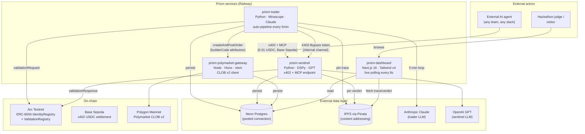
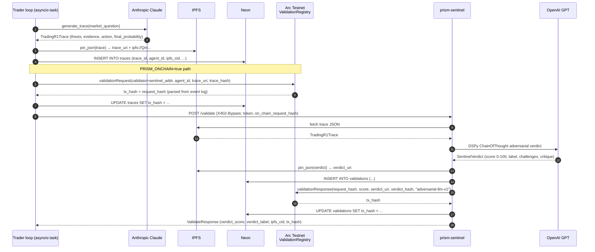
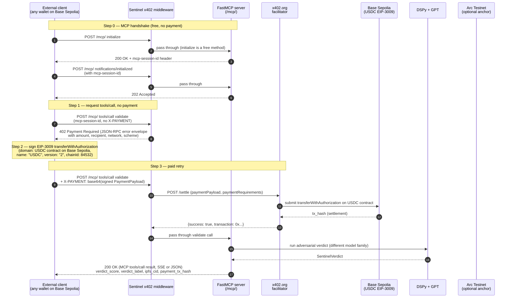
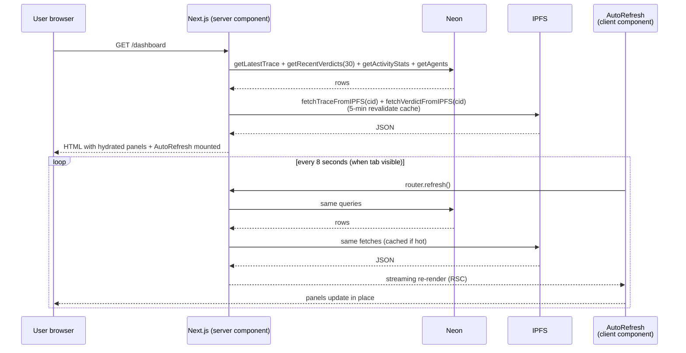
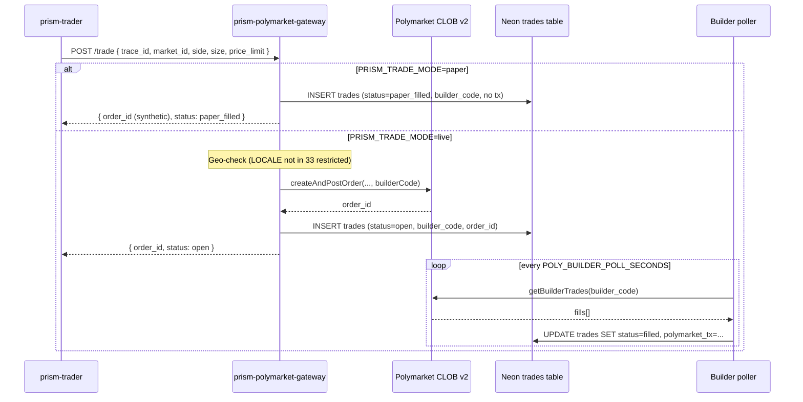
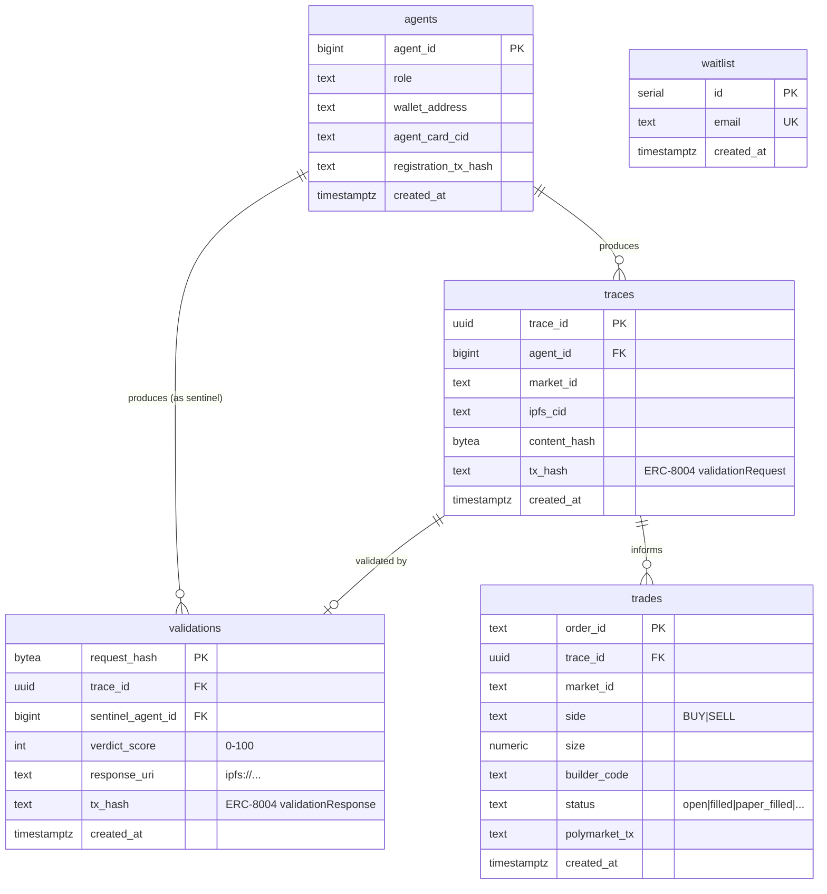

# Prism — Architecture

The first adversarial AI validator on ERC-8004. Two agents from different
model families challenge each other before capital moves; every verdict is
anchored on Arc Testnet; the sentinel is sold by the call over x402.

This document is the **operator and judge map** of the system — what
services exist, how they talk, and what's verifiable on which chain.

---

## System map

---

## Services in detail

| Service | Language | Role | Port |
|---|---|---|---|
| `prism-trader` | Python 3.12 / Mirascope / Claude | Generates Trading-R1 reasoning traces every 5 min, submits ERC-8004 `validationRequest`, calls sentinel via internal bypass, optionally executes Polymarket orders | 3201 |
| `prism-sentinel` | Python 3.12 / DSPy / GPT | Adversarially validates traces (evidence challenges, thesis challenges, calibration critique). Exposes `POST /validate` (REST) and `/mcp/` (FastMCP, x402-protected) | 3202 |
| `prism-polymarket-gateway` | Node 20 / Hono / viem | Wraps `@polymarket/clob-client-v2`. Adds `builderCode` to every order. Polls fills, persists to DB. Paper-mode + live-mode | 3203 |
| `prism-dashboard` | Next.js 16 / React 19 / Tailwind v4 | Public surface. Live polling, verdict history, confidence-collision viz, adversarial dialogue, on-chain receipts | 3200 |

The MCP module (`apps/mcp/`) is **not a separate service** — it's an ASGI
sub-app mounted on `prism-sentinel` at `/mcp/`. This is a deliberate
deployment shortcut for the hackathon.

---

## Sequence diagram — the trader auto-pipeline (every 5 minutes)

**What you can verify on-chain:** every successful pipeline tick produces
**two** transactions on Arc Testnet — a `validationRequest` from the trader
wallet (`0xc960833e…`) and a `validationResponse` from the sentinel wallet
(`0x56509b03…`), both calling the
[ValidationRegistry at `0x8004Cb1BF31DAf7788923b405b754f57acEB4272`](https://testnet.arcscan.app/address/0x8004Cb1BF31DAf7788923b405b754f57acEB4272).

---

## Sequence diagram — external x402 + MCP call (the "sentinel-as-a-service" demo)

**Verifiable artifacts produced by one external call:**

- USDC transfer on **Base Sepolia** at the facilitator-submitted tx hash
- A pinned verdict JSON on IPFS
- A row in Neon's `validations` table

**One thing this flow does NOT do:** anchor the verdict on Arc. That's
intentional — the external client has no agent identity on Arc, so there's
no preceding `validationRequest` to anchor a `validationResponse` against.
This is the trade-off of accepting payments from anyone vs. only validating
agents that registered on ERC-8004. The auto-pipeline path keeps the full
on-chain story for Prism's own trader.

---

## Sequence diagram — dashboard live polling

`router.refresh()` is preferred over a custom `/api/dashboard-state` route
because it re-runs the existing server components, reusing the IPFS cache,
without any client-side data model.

---

## Polymarket trade flow (paper vs live)

The `builderCode` is a 32-byte hex value Prism owns; **every order created
through this gateway includes it**, so when the order fills, Prism gets
builder-fee revenue. AGENTS.md requires this — it's enforced in
`gateway.ts`, not as a manual reminder.

---

## Data layer

All services connect to the **same Neon database** over the pooled
connection string (`-pooler` suffix). Per AGENTS.md hard rule #12,
unpooled URLs are reserved for migrations only.

---

## Verifiable on-chain identifiers

| What | Where | Address / contract |
|---|---|---|
| ERC-8004 IdentityRegistry | Arc Testnet | [`0x8004A818BFB912233c491871b3d84c89A494BD9e`](https://testnet.arcscan.app/address/0x8004A818BFB912233c491871b3d84c89A494BD9e) |
| ERC-8004 ValidationRegistry | Arc Testnet | [`0x8004Cb1BF31DAf7788923b405b754f57acEB4272`](https://testnet.arcscan.app/address/0x8004Cb1BF31DAf7788923b405b754f57acEB4272) |
| ERC-8004 ReputationRegistry | Arc Testnet | [`0x8004B663056A597Dffe9eCcC1965A193B7388713`](https://testnet.arcscan.app/address/0x8004B663056A597Dffe9eCcC1965A193B7388713) |
| Trader Circle wallet (EOA) | Arc Testnet | [`0xc960833ee26e23ca01dfc4d217a8942ea78b452b`](https://testnet.arcscan.app/address/0xc960833ee26e23ca01dfc4d217a8942ea78b452b) |
| Sentinel Circle wallet (EOA) | Arc Testnet | [`0x56509b03e85f3cbae5ba2190ee99b945d2f0ac36`](https://testnet.arcscan.app/address/0x56509b03e85f3cbae5ba2190ee99b945d2f0ac36) |
| Oracle Circle wallet (EOA) | Arc Testnet | [`0xc95dfe848354482830805cdd8b8233a918cd16f7`](https://testnet.arcscan.app/address/0xc95dfe848354482830805cdd8b8233a918cd16f7) |
| Prism x402 recipient | Base Sepolia (testnet) / Base mainnet | `0x1453ba8a6bDD647eB98F380443FDD54074fffD1F` |
| Polymarket builder code | Polygon mainnet | `0x9e599436ce291bcda25bd18c611e46eb54bd7dd12bead05d0027802a9ef30c2e` |

The three Arc wallets are **Circle Developer-Controlled Wallets** with
`accountType=EOA`. SCA migration is post-hackathon work (see `AGENTS.md`
"Circle SDK usage" notes and `SETUP.md` §1b).

---

## Why this shape

Three design decisions worth flagging:

### 1. Cross-family adversarial validation (not single-model self-review)

The trader is Anthropic Claude. The sentinel is OpenAI GPT. These are
two independent training corpora and RLHF pipelines. Per AGENTS.md hard
rule #2, this is configured via env vars and **validated at startup** —
if the two services land on the same model family, the process exits.

This is the central thesis: an agent reviewing its own reasoning is
hindsight-biased and shares the same blind spots. Two cross-family
agents disagreeing is signal that capital should not move.

Calibration evidence: synthetic-trace test
(`apps/sentinel/src/tests/test_calibration.py`) shows good=65, mediocre=42,
bad=20 — a **45-point spread** between good and bad reasoning, well above
the 30-point bar from rule #11.

### 2. ERC-8004 + Circle Wallets, not a custom registry

We **deploy zero Solidity**. All on-chain reads and writes go through
Arc's deployed `IdentityRegistry`, `ValidationRegistry`, and
`ReputationRegistry`. All transactions are signed by Circle
Developer-Controlled Wallets, which means no raw private keys appear in
the codebase (AGENTS.md hard rule #6).

The trade-off: every contract call costs ~0.003 USDC of gas (EOA pays
from balance; Gas Station sponsorship would require SCA migration —
see `AGENTS.md` Circle SDK notes).

### 3. x402-protected sentinel-as-a-service

The whole point of ERC-8004 is that *agent owners can't validate their
own agents* — there's an explicit "external validator" slot in the spec.
Prism's sentinel fills that slot, and any external agent can call it for
$0.01 USDC via x402.

The protocol layer is MCP (FastMCP) mounted at `/mcp/`, so any
MCP-compatible client speaks the right shape. The payment layer is x402
v2 (EIP-3009 USDC transferWithAuthorization on Base Sepolia, settled
through the public x402.org facilitator).

The setup methods (`initialize`, `tools/list`, etc.) are **exempt from
the paywall** so clients can complete the MCP handshake without
chicken-and-egg with the payment step.

Reference implementation of an external client:
[`scripts/call_prism_sentinel.py`](../scripts/call_prism_sentinel.py) —
single file, PEP 723 inline deps, runnable with `uv run`. See the
`docs/demos/` directory for a committed Markdown receipt + terminal
log of a real settlement.

---

## What's measurably true vs. aspirational

Honest snapshot to keep posts and submissions grounded.

| Claim | Status as of May 14, 2026 |
|---|---|
| Trader auto-pipeline running 24/7 | ✅ True, ticks every 5 min on Railway |
| Cross-family adversarial validation | ✅ True (anthropic-claude × openai-gpt verified in startup logs) |
| Every new verdict anchored on Arc | ✅ True from 19:59 UTC May 13 onwards (earlier backlog of 175 traces left unanchored) |
| External x402+MCP call works | ✅ True, reproducible via `scripts/call_prism_sentinel.py` |
| Sentinel-as-a-service public endpoint | ✅ True, no auth, $0.01 USDC per call on Base Sepolia |
| Polymarket builder attribution | ⚠ Code path live + tested in paper mode. Real fills pending wallet funding. |
| Polymarket trades on real markets | ❌ All `paper_filled` / `paper_pending` / `paper_failed` as of May 14 |
| Calibration discrimination ≥ 30 points | ✅ True (45-point gap on synthetic traces) |
| Gas Station sponsorship | ❌ Wallets are EOA; Gas Station only sponsors SCA (Phase 1 work) |
| MCP service deployed | ✅ True, as ASGI sub-app inside sentinel at `/mcp/` |

---

## Operational defaults

- **Trade mode:** `paper` (all environments). Switch to `live` only after
  Polymarket wallet is funded.
- **Auto-pipeline interval:** 300 seconds (every 5 minutes).
- **Dashboard polling:** 8 seconds when tab is visible, paused when hidden.
- **x402 settlement timeout:** 10 seconds.
- **IPFS gateway:** `ipfs.io` for reads (switched from rate-limited Pinata
  May 13), Pinata Picnic plan for writes.
- **Geofence:** locale must be in
  `apps/trader/src/trader/config.py::POLYMARKET_RESTRICTED_COUNTRIES`
  complement; process exits at startup otherwise.

---

*Last updated: May 14, 2026 (Day 3 of the @CanteenApp × @BuildOnArc hackathon).*
